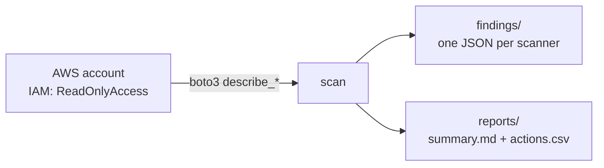

# aws-cost-optimizer-cli

[](https://github.com/sarteta/aws-cost-optimizer-cli/actions/workflows/tests.yml)
[](https://www.python.org)
[](./LICENSE)

Python CLI that scans an AWS account and lists the obvious cost leaks
most teams can clean up in a sprint:

- Idle EC2 instances (avg CPU <5% over last 14 days)
- Unattached EBS volumes (billed, never mounted)
- Old EBS snapshots (>90 days, parent volume deleted)
- Unassociated Elastic IPs ($0.005/h each, easy to forget)
- Oversized RDS (avg CPU <20% + connections <10% of max)
- S3 buckets without lifecycle policies (standard storage >180 days)
- NAT gateways in dev VPCs

Output is a ranked CSV + a Markdown summary you can paste into Jira or Slack.



Lectura en español: [README.es.md](./README.es.md)

## Why this exists

Every AWS account I've taken over had 15-25% of spend on things nobody was
using. The commercial tools that flag this stuff (Compute Optimizer,
Trusted Advisor Business, Vantage, CloudHealth) charge per account and the
findings are usually the same handful of patterns. This CLI covers those
patterns in ~800 lines of Python you can read in an afternoon.

Read-only. It doesn't delete, resize or modify anything — it just writes
a report. Actual cleanup is a separate Terraform PR, done by a human.

## Quickstart

```bash
# Requires Python 3.11+ and AWS credentials (env / profile / role)
pip install -r requirements.txt

# Dry scan against the configured profile (read-only, ~30-90s)
python -m src.scan --profile default --region us-east-1

# Multi-region scan, write reports
python -m src.scan \
  --profile prod \
  --regions us-east-1,us-west-2,eu-west-1 \
  --output reports/2026-04-prod

# Mock mode — no AWS account needed, useful for demos / CI
python -m src.scan --mock --output reports/mock-demo
```

## Sample run (mock mode)

Actual output from `python -m src.scan --mock --output reports/demo`:

```
Scanned 1 region(s) on account 123456789012
Findings: 9   Est. monthly waste: $651.61
Reports written to: reports/demo/
```

Top findings from `reports/demo/summary.md`:

| rank | type              | id                      | est. $/mo | action                                                  |
|------|-------------------|-------------------------|-----------|---------------------------------------------------------|
| 1    | `rds_oversized`   | `prod-legacy`           | $249.66   | downsize db.m5.xlarge → db.m5.large (avg CPU 9.3%)      |
| 2    | `ec2_idle`        | `i-bastion`             | $248.20   | stop or rightsize (avg CPU 0.8% over 14d)               |
| 3    | `s3_no_lifecycle` | `old-backups-2022`      | $73.60    | add lifecycle policy (size ~3200 GB, no rules)          |
| 4    | `ebs_orphan`      | `vol-orphan1`           | $40.00    | delete (unattached gp3 volume, 500 GB)                  |
| 5    | `ebs_snapshot_old`| `snap-ancient`          | $12.50    | review & delete (age 540d, 250 GB)                      |
| 6    | `s3_no_lifecycle` | `temp-exports-forgotten`| $10.35    | add lifecycle policy (size ~450 GB, no rules)           |
| 7    | `ebs_orphan`      | `vol-orphan2`           | $10.00    | delete (unattached gp2 volume, 100 GB)                  |
| 8    | `eip_unused`      | `3.210.2.2`             | $3.65     | release Elastic IP (not associated)                     |
| 9    | `eip_unused`      | `3.210.3.3`             | $3.65     | release Elastic IP (not associated)                     |

Full sample output is in [`examples/demo-report/`](./examples/demo-report/) — browse the CSV and Markdown to see the exact shape the tool produces without running anything.

## IAM permissions

The CLI is read-only. The included `iam/cost-optimizer-readonly.json` is a
minimal policy — about 25 actions across `ec2:Describe*`, `rds:Describe*`,
`s3:GetBucket*`, `ce:GetCostAndUsage`, `cloudwatch:GetMetricStatistics`.

## Design notes

See `docs/ARCHITECTURE.md` for:

- How the pricing estimates are computed. They use list price per instance
  type. Savings Plans / RIs will distort the numbers — the report is a
  ranking signal, not an invoice.
- Why each finding is its own module under `src/findings/`. Teams can
  disable the ones that don't apply to their account shape.
- What the mock mode does (builds a synthetic account with known leaks
  so you can demo / test without real AWS creds).

## Roadmap

- [ ] `--apply` mode that writes Terraform import blocks for orphan
      resources (so you can manage-then-destroy)
- [ ] Slack notifier (post top 5 findings weekly)
- [ ] Compute Savings Plans coverage estimator
- [ ] Lambda cold-resource finder (functions not invoked in 60+ days)

## License

MIT © 2026 Santiago Arteta
